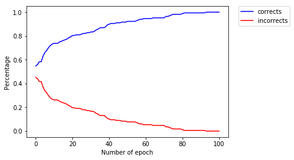
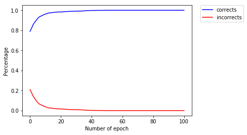

# Tarea 1 - Entrenar una red neuronal

## Requerimientos

* scikit-learn
* NumPy
* Matplotlib

## Datasets soportados

El código fue probado con los datasets de [seeds](https://archive.ics.uci.edu/ml/datasets/seeds) y [wifi indoor localization](https://archive.ics.uci.edu/ml/datasets/Wireless+Indoor+Localization), pero deberíaa funcionar con cualquier dataset cuyos atributos sean números y deban ser clasificados a una única clase.

## Implementación

La implementación de la red neuronal utiliza objetos, teniendo tres clases principales: *Neuron* para cada neurona; *NeuronLayer* para cada capa de neuronas; y *NeuralNetwork* para la red neuronal. Todo el entrenamiento y predicciones se realizan a través de un objeto de la clase *NeuralNetwork*, pues los objetos de las otras clases son creados de manera automática.

Las funciones de activación se representan con objetos, teniendo dos métodos necesarios:

* *apply*(x): aplica la función al valor *x*
* *derivative*(x): aplica la derivada de la función al valor *x*

### Configuración de la red neuronal

La red neuronal genera datos aleatorios para los pesos y funciones de activación, además de tener valores definidos para el *learning rate* y la cantidad de iteraciones de cada entrenamiento. Sin embargo, también posee funciones para definir manualmente estos valores, las cuales son:

* set_weights(weights)
* set_activation_functions(functions)
* set_learning_rate(lr)
* set_iterations(n)

Además, una vez *seteados* estos valores, debe utilizarse la función *build()* para crear las capas de neuronas.

### Entrenamiento de la red neuronal

El entrenamiento de la red se realiza con el método *train*, el cual tiene como argumentos los todos atributos y las clases que se deseen utilizar en el entrenamiento. Es necesario que los arreglos de los atributos y las clases coindican en los índices (es decir, los i-ésimos atributos entregados están asociados a la i-ésima clase entregada).

La clasificación se realiza utilizando *1-hot encoding* para las clases buscadas, por lo que soporta tanto clases tipo *string* como numéricas.

### Predicciones

Una vez que se ha entrenado la red neuronal, basta utilizar el método *feed*, entregándole como argumento un arreglo con los atributos de los cuales se desea encontrar la clase. El valor entregado será un arreglo en *1-hot encoding*, aun que en vez de unos, tendrá un número real entre 0 y 1, el cual deberá ser ajustado mediante una función *step* para determinar si finalmente será 1 ó 0 (en el archivo *main.py* esto se hace con la función *fit*).

### Eficiencia

Dado que el entrenamiento se hace de manera secuencial, el entrenamiento para datasets muy grandes puede tardar bastante tiempo, sobre todo si se realiza una gran cantidad de iteraciones cada vez.

## Resultados

El entrenamiento se realizó separando el dataset en 80% entrenamiento y 20% testeo de forma aleatoria. La información que se presenta son las predicciones realizadas sobre el set de testeo.

En general, los resultados obtenidos son bastante buenos. A continuación se puede observar como la red neuronal aumenta la cantidad de clases correctas predichas cada vez, y disminuye las incorrectas. Además, en las matrices de confusión se observa que casi todas las clases fueron predichas casi completamente de forma correcta.

### Seeds dataset

|                 |    |   | **Predicted Values** |    |
|:---------------:|:--:|:-:|:--------------------:|:--:|
|                 |  clase  | 0 |         1            |  2 |
| **True Values** |  0 | 8 |         0            |  3 |
|                 |  1 | 0 |        14            |  0 |
|                 |  2 | 0 |         0            | 17 |

### Wifi localization dataset

|                 |    |    | **Predicted Values** |    |     |
|:---------------:|:--:|:--:|:--------------------:|:--:|:---:|
|                 |    |  0 |                    1 |  2 |   3 |
|                 |  0 | 96 |           0          |  6 |  2  |
| **True Values** | 1  |  1 |          89          |  5 |  0  |
|                 | 2  |  0 |           0          | 88 |  0  |
|                 | 3  |  0 |           0          |  2 | 111 |
