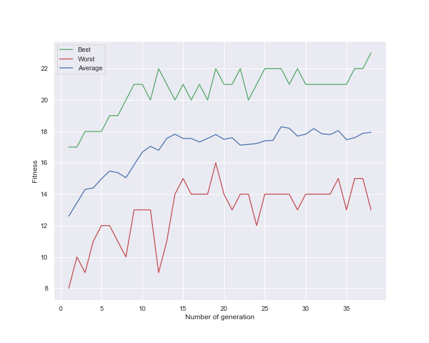
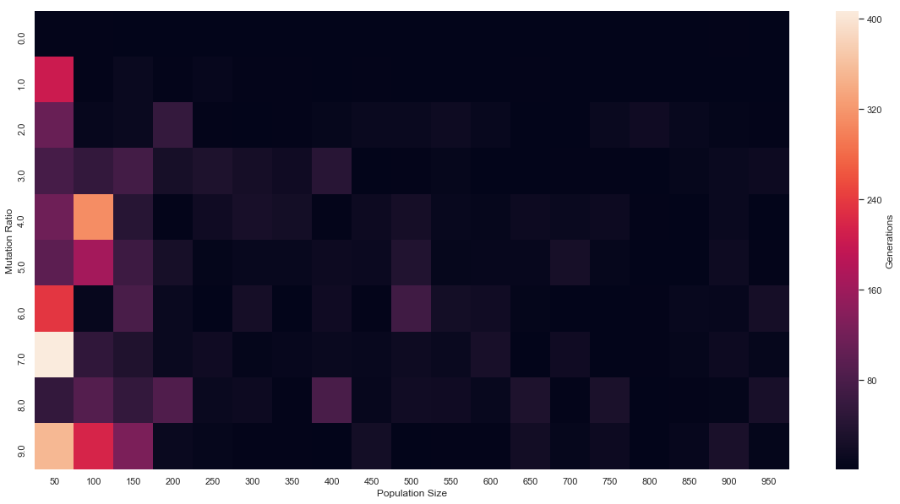

# Tarea 2 - Implementación de Algoritmo Genético

## Requerimientos

* Matplotlib
* seaborn
* pandas

## Problema: Unbound-Knapsack

Para una mochila que aguanta 15kg, encuentre la combinación de cajas que maximice el valor contenido en la mochila, pero que no se pase del peso máximo soportado. Las cajas permitidas son las siguientes:

* Caja de peso 12 y valor 4.
* Caja de peso 2 y valor 2.
* Caja de peso 1 y valor 2.
* Caja de peso 1 y valor 1.
* Caja de peso 4 y valor 10.

Para resolver este problema, se consideró que un gen era una caja (cualquiera de las anteriormente mencionadas), por lo que un individuo es un conjunto de cajas cuyo peso es menor a 15. Además, se utiliza la función de fitness como el valor total de las cajas del individuo, pues es el valor que se busca maximizar.

## Resultados

### Gráfico
El siguiente gráfico de generaciones vs fitness muestra la evolución de los fitness para el mejor y peor individuo de cada generación, además del promedio para el problema de encontrar una secuencia de bits.

### Heatmap
El siguiente heatmap muestra la cantidad de generaciones que tarda en encontrarse la solución para el problema de encontrar una secuencia de bits, para distintas configuraciones de población y tasa de mutación.

## Análisis

La implementación es en gran parte una abstracción que, bajo ciertas limitancias, puede funcionar para distintos problemas. Hay dos requisitos para ello: el primero es implementar una subclase de AbstractIndividual, implementando el método *reproduceWith*; mientras que el otro consiste en crear la función de fitness, el generador de un gen, la condición de término, y el generador de individuos. El problema con esto es que su implementación es muy específica, y debe seguirse ciertas restricciones para cada uno de estos métodos.