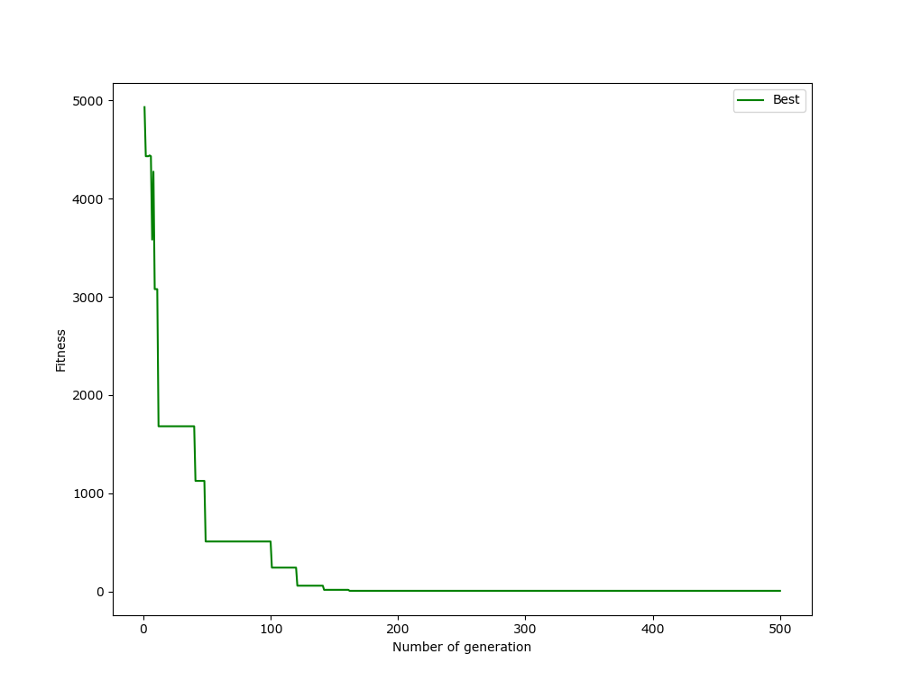
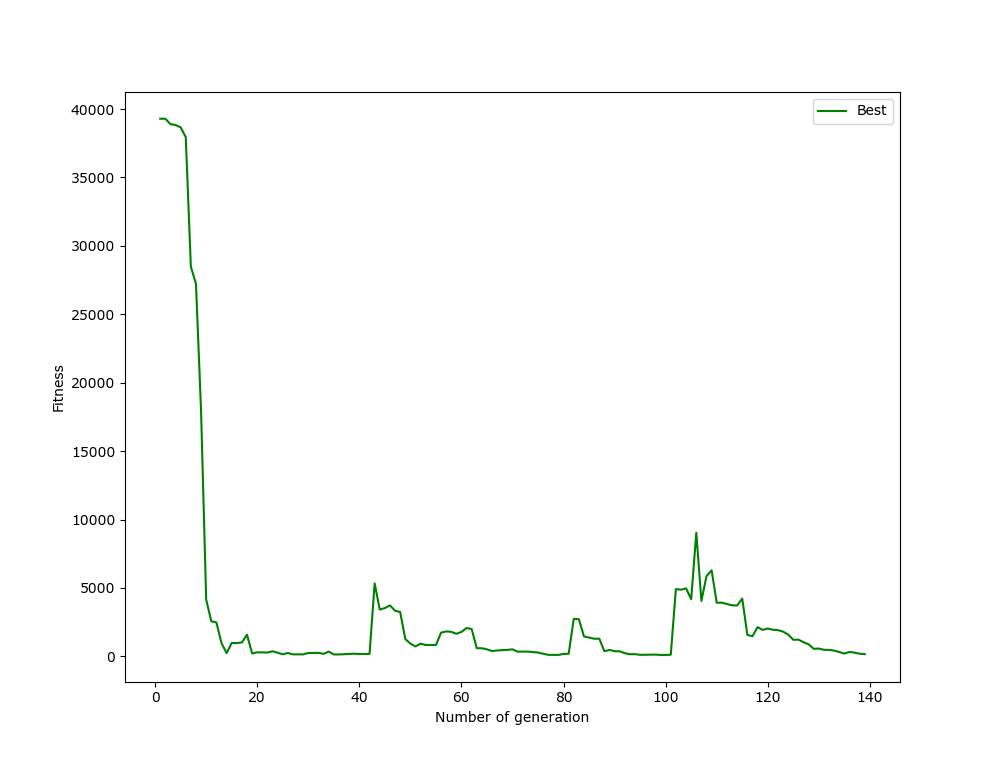
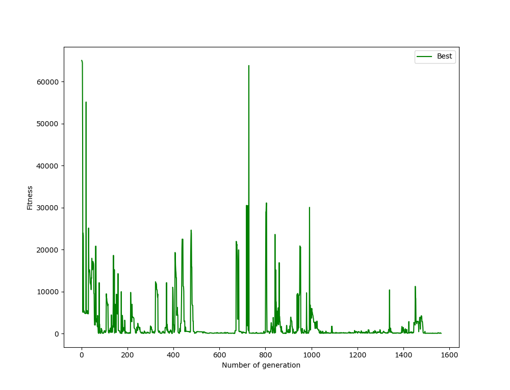
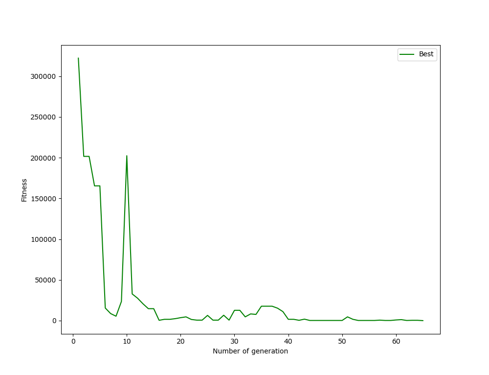

# Encontrar un número

Se desea encontrar un número utilizando terminales (números) y funciones (operaciones) dadas. Para los siguientes experimentos se buscó llegar al número `65346` utilizando el conjunto de terminales `{25, 7, 8, 100, 4, 2}`.

## Sin castigo

Operaciones admitidas: suma (+), resta (-), multiplicación (\*) y máximo (max).

Para el caso en el que sólo importa encontrar el resultado sin ningún tipo de restricción, se obtuvo la siguiente evolución para el fitness:

## Castigando árboles muy grandes

Operaciones admitidas: suma (+), resta (-) y multiplicación (\*).

Para el caso en el que se desea llegar al resultado con el árbol más pequeño, se obtuvo la siguiente evolución para el fitness:

## Castigando repeticiones

Operaciones admitidas: suma (+), resta (-) y multiplicación (\*).

Para el caso en el que se desea llegar al resultado (o una aproximación de este) sin repetir terminales, se obtuvo la siguiente evolución para el fitness:

# Symbolic Regression

Se desea encontrar la función `x^2 + x - 6` o una aproximación de esta para el rango de valores `[-100, 100]`, utilizando los terminales `{-10, ..., 10, x}`.

# Implementación de variables

Para implementar variables, un nodo terminal puede recibir un string como valor (y esta será su representacion). Luego, la funcion `eval` debe recibir un diccionario de la forma {variable:string: valor:int} tal que dicha variable se reemplace por el valor entregado. En caso de que el valor entregado para crear el nodo no sea un string, no debe entregarse un diccionario para la funcion `eval` (es decir, sigue funcionando como antes).

Operaciones admitidas: suma (+), resta (-) y multiplicación (\*).

# Implementar la división

Operaciones admitidas: suma (+), resta (-), multiplicación (\*) y división (/).

